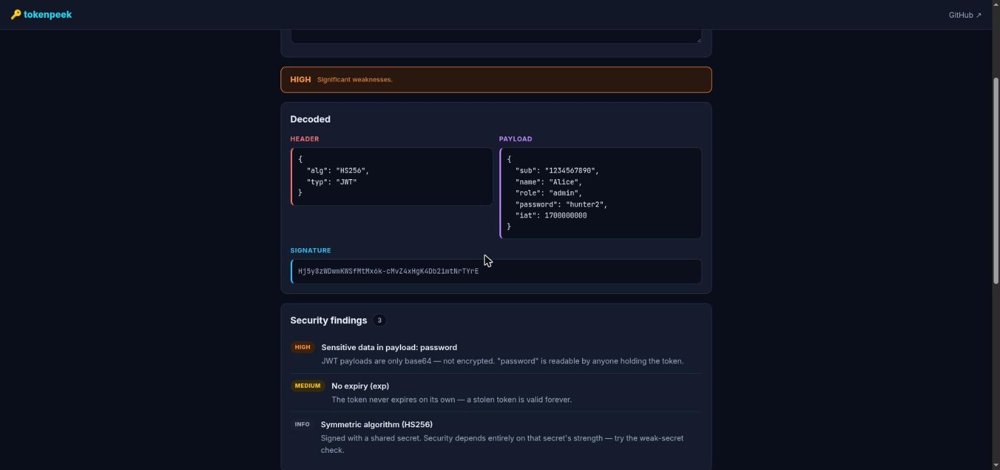

# 🔑 tokenpeek

> A **JWT & token security analyzer** that runs entirely in your browser. Paste a JSON Web Token to decode it and surface the security weaknesses — `alg=none`, weak HMAC secrets, key-injection headers, sensitive data in the payload, bad expiry. **Nothing ever leaves your device.**

🔗 **[Live demo → defamp.github.io/tokenpeek](https://defamp.github.io/tokenpeek/)**



Online JWT debuggers are handy, but pasting a real token into a third-party server is exactly how tokens leak. `tokenpeek` does the decoding **and** a security review 100% client-side — no backend, no requests, no analytics.

---

## ✨ Features

- **Decode** — header / payload / signature, color-coded, with pretty-printed JSON.
- **Security findings** — ranked by severity:
  - `alg=none` signature bypass (**critical**)
  - missing signature, symmetric vs. asymmetric algorithm notes, algorithm-confusion hints
  - key-injection headers — `jku`, `x5u`, embedded `jwk`, and path-traversal/SQLi in `kid`
  - **sensitive data in the payload** (passwords, API keys, cards) — JWTs are *signed, not encrypted*
  - no expiry, very long lifetime, expired / not-yet-valid tokens
- **Claims timeline** — `exp` / `nbf` / `iat` rendered as absolute + relative time ("expired 2 hours ago").
- **🔓 Weak-secret cracking** — for HS256/384/512, tests the signature against a bundled list of common secrets using the **Web Crypto API**. Catches the classic "forgot to change the JWT secret" bug. Also verify against a specific secret.
- **Signature verification** — for RS/ES/PS tokens, paste a public key (PEM) to verify the signature in-browser.
- **Verdict** — one-line `OK / LOW / MEDIUM / HIGH / CRITICAL` summary.
- **Zero dependencies, zero build step** — plain HTML/CSS/JS, deployable to any static host.

## 🔒 Privacy

Everything — decoding, the security checks, and all cryptography — happens locally via the browser's Web Crypto API. `tokenpeek` makes **no network requests**. Open the Network tab and watch: nothing leaves the page.

## 🚀 Run locally

It's static — just serve the folder:

```bash
git clone https://github.com/defamp/tokenpeek
cd tokenpeek
python3 -m http.server 8000   # then open http://localhost:8000
```

(A local server is only needed so the browser treats it as a secure context for Web Crypto.)

## 🧪 Tests

The analysis logic (`js/analyzer.js`) is pure and unit-tested with Node's built-in test runner — no dependencies:

```bash
node --test
```

## 🧩 Where it fits

`tokenpeek` is the web-based, interactive counterpart to the CLI tools in the toolkit — [ioc-hunter](https://github.com/defamp/ioc-hunter), [logsleuth](https://github.com/defamp/logsleuth), [phishtriage](https://github.com/defamp/phishtriage), [maltriage](https://github.com/defamp/maltriage) — covering the authentication / appsec side.

## ⚠️ Disclaimer

For defensive analysis and learning on tokens you are authorised to inspect. The weak-secret check only tries a short list of well-known secrets; a "no match" result is **not** proof a secret is strong.

## 📄 License

MIT © Defa Mulya Pratama
